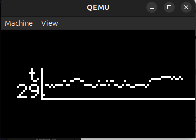

# Laboratorio FreeRTOS

En este repositorio se aborda el laboratorio 4 de sistemos operativos 2 de la facultad de ciencias exactas fisicas y naturales. En este se simula un sensor de tempratura funcioando en un `Stellaris lms3811` emulado con `Quemu`.

<div align="center">
  
</div>

## Conceptos clave

### ¿Que es un sistema operativo en tiempo real?

Un sistema operativo en tiempo real (RTOS) es un software diseñado para gestionar recursos de hardware y ejecutar tareas de forma determinista, garantizando respuestas dentro de plazos predefinidos. Esto permite que aplicaciones críticas, como sistemas embebidos o controladores industriales, respondan a eventos externos en tiempos exactos, minimizando la latencia y asegurando que las operaciones se completen en el período requerido.

####  ¿Como lo logra? 

 En un RTOS, la ejecución se divide en múltiples tareas, cada una representando una unidad de trabajo que puede ser programada de forma independiente. El reloj del sistema genera interrupciones periódicas (ticks) que sirven de base temporal para el planificador; este, en cada tick, evalúa qué tarea debe ejecutarse según su prioridad y los requisitos temporales definidos. Además, las interrupciones permiten responder de manera inmediata a eventos externos, forzando la preempción de la tarea en ejecución si es necesario atender un evento crítico. De esta forma, la sincronización del reloj, el manejo eficiente de interrupciones y la administración de tareas aseguran que las operaciones se realicen dentro de plazos estrictos y predecibles, lo que es fundamental para cumplir con los requisitos de tiempo real.

#### ¿Que es FreeRTOS?

FreeRTOS es un sistema operativo en tiempo real (RTOS) diseñado para microcontroladores y pequeños microprocesadores. Se utiliza en sistemas embebidos y es compatible con más de 40 arquitecturas de procesadores. Entre sus características técnicas se destacan su bajo consumo de memoria y sus tiempos de ejecución rápidos. Además, FreeRTOS incluye funciones avanzadas, como el soporte para Multiprocesamiento Simétrico (SMP), lo que permite la ejecución concurrente en sistemas con múltiples núcleos; un stack TCP diseñado para ser seguro en entornos multi-hilo con soporte para IPv6; y mecanismos para integrarse de forma sencilla con servicios en la nube. Al ser de código abierto, permite su adaptación y mejora continua a través de una comunidad activa y su mantenimiento constante.

En este proyecto no nos valdremos de sus funciones mas avanzadas, sino que nos centraremos en su capacidad de funcionar en microcontroladores de bajo rendimiento.

### ¿Como esta dividio el proyecto?

El sistema esta dividido en 4 tareas o `Tasks`:

- `vRandomGenTask`     -> Generar valores aleatorios que se usaran para simular las mediciones de temperatura
- `vLowPassFilterTask` -> Filtro pasa bajos 
- `vUartReceiveTask`   -> handler UART para actualizar filtro
- `vGraphTask`         -> Graficador en LCD de los valores filtrados.
- `vTop`               -> Top like task para monitorear el uso de recursos de las tareas

## vRandomGenTask

Definimos una semilla, con ella se establece el estado inicial del sistema, con una misma semilla siempre obtendremos el mismo output. Obteniendo asi un sistema `pseudo aleatorio`
```c
/* Random number seed */
static uint32_t ulRandomSeed = 12345;
```
El algoritmo LCG (Linear Congruential Generator) es uno de los métodos más simples y ampliamente usados para generar secuencias de números pseudo-aleatorios. Utiliza una fórmula matemática que, partiendo de una semilla inicial, produce una serie de números que parecen aleatorios.

    Xₙ₊₁ = (a * Xₙ + c) % m

Definimos m utilizando el valor maximo que queremos generar `max` y  el valor minimo `min`

    m = (max - min + 1)

`m` tambien representa la cantidad de valores que podemos generar dado que estamos usando la operacion modulo `%`. Si al resultado le sumamos `min` obtenemos el generador en el rango deseado [min, max].
```c
static int prvGenerateRandomNumber(int min, int max)
{
    ulRandomSeed = (ulRandomSeed * 1664525U + 1013904223U);
    return (ulRandomSeed % (max - min + 1)) + min;
}
```
Ahora invocamos esta funcion dentro de nuestra task para que se ejecuta cada un determinado periodo de tiempo y envie el resultado a la tarea del filtro que se va a encargar de procesarlo.

```c
static void vRandomGenTask(void *pvParameters)
{
    int randomNumber;
    for (;;)
    {
        randomNumber = prvGenerateRandomNumber(TEMP_MIN, TEMP_MAX);
        xQueueSend(xSensorValueQueue, &randomNumber, portMAX_DELAY);
        vTaskDelay(pdMS_TO_TICKS(GENERATION_DELAY_MS));
    }
}
```

## Comunicación entre tareas

Para que las tareas puedan enviarse datos entre si y tabajar de forma conjunta utilizamos colas. Las colas en FreeRTOS funcionan como estructuras FIFO (First In, First Out) que permiten que una tarea (o ISR) envíe datos a la cola y otra tarea los reciba de manera ordenada. Esto facilita el intercambio de información sin compartir directamente variables globales, lo que reduce el riesgo de condiciones de carrera.

Además, las operaciones de envío y recepción en una cola pueden configurarse para bloquear la tarea si la cola está llena (al enviar) o vacía (al recibir), lo que permite una sincronización eficiente basada en eventos. De esta forma, el sistema puede garantizar que las tareas se activen solo cuando hay datos disponibles o espacio para enviar información, contribuyendo al comportamiento determinista de la aplicación en tiempo real.

## vLowPassFilterTask
Esta tarea se va a encargar de leer la cola `xSensorValueQueue` y obtener las mediciones de temperatura en crudo. Las mediciones se guardan en un buffer de tamaño `n`. En cada nueva medicion recibida calcula la media de los `n` valores y lo envia una nueva cola `xFilteredValueQueue` donde será tomada por la tarea graficadora.

### Buffer Circular

Para construir el buffer utilizaremos un arreglo convenconal de tamaño fijo `MAX_FILTER_WINDOW_SIZE`. A medida que nuevas mediciones van llegando, se insetan en el arreglo comenzando desde la posicion 0 como es natural, cuando el buffer se llena, se comienza de nuevo desde la posicion 0 y se sobreescriben de 1 los siguientes valores.

Buffer vacio
```
[0,0,0,0,0,0,0,0,0,0]
```
Llega una medición
```
[12,0,0,0,0,0,0,0,0,0]
```
Buffer lleno
```
[10,23,14,32,40,20,15,17,36]
```
Llega otra medición, se reemplaza primer valor
```
[22,23,14,32,40,20,15,17,36]
```
Y asi sucesivamente. De forma simple y natural.

### Calculo de Media

El requerimiento del ejecercio solicita que se calcule una media con los ultimos `n` valores. Esto lo haremos tomando en primer instancia el ultimo valor añadido, que su posicion en el arreglo esta dando por una variable `index` y sumamos todas las mediciones hasta `index - n`. Pero esto nos trae 2 alternativas.

Si `index - n >= 0`
```
sum(index - n .... index)/n
```
Si `index - n < 0`
```
(sum(0 .... index) + sum(MAX_FILTER_WINDOW_SIZE-(index-n) ..... MAX_FILTER_WINDOW_SIZE)) / n
```

O simplificado en código

```c
int sum = 0;
for (int i = 0; i < sampleCount; i++)
{
    int pos = (index + MAX_FILTER_WINDOW_SIZE - i) % MAX_FILTER_WINDOW_SIZE;
    sum += buffer[pos];
}
filteredValue = sum / sampleCount;
```

### Warm Up

Durante las primeras mediciones, la tarea no dispone de `n` valores para calcular la media de forma correcta. Es por esto que se define una variable `sampleCount` que se incrementa cada vez que se inserta una medicion en el buffer circular hasta alcanzar el `n` deseado. `sampleCount` es el valor que se utiliza para calculo final de la media. 

En caso de que `n` cambie, si este es menor, seguira incrementando, en caso contrario `sampleCount = n`


```c
if (sampleCount < g_filterWindowSize)
{
    sampleCount++;
}
else
{
    sampleCount = g_filterWindowSize;
}
```
            
## vUartReceiveTask

Tarea para recibir valores de n dinámicos
La tarea espera que ingrese un digito de hasta 3 cifras seguido de un salto de linea o carry.

```c
static void vUartReceiveTask(void *pvParameters)
{
    static char inputBuf[4] = {0};
    int idx = 0;
    for (;;)
    {
        while ((HWREG(UART0_BASE + UART_O_FR) & UART_FR_RXFE) == 0)
        {
            char c = (char)(HWREG(UART0_BASE + UART_O_DR) & 0xFF);
            if ((c >= '0') && (c <= '9'))
            {
                if (idx < 3)
                {
                    inputBuf[idx++] = c;
                }
            }
            else if ((c == '\n') || (c == '\r'))
            {
                int number = 0;
                for (int i = 0; i < idx; i++)
                {
                    number = number * 10 + (inputBuf[i] - '0');
                }
                if ((number > 0) && (number <= MAX_FILTER_WINDOW_SIZE))
                {
                    g_filterWindowSize = number;
                }
                idx = 0;
                inputBuf[0] = '\0';
            }
        }
        vTaskDelay(pdMS_TO_TICKS(50));
    }
}
```

### En Detalle

El nuemero sera guardado dentro de un arreglo de tamaño 4, ya que dejamos un lugar para el caracter de finalización. Tambien definimos un indice para recorrer el arreglo

```c
static char inputBuf[4] = {0};
int idx = 0;
```

Se examina el registro flag de la UART. Para leerlo se parte de la posicion base de los registros de UART en memoria `UART0_BASE`, nos desplazamos hasta el registro flag `UART_O_FR`, accedemos al contenido usando `HWREG` y obtenemos en concreto el bit `UART_FR_RXFE` que nos indica si la FIFO de recepcion esta vacía (RX FIFO EMPTY)

```c
while ((HWREG(UART0_BASE + UART_O_FR) & UART_FR_RXFE) == 0)
```

Siempre que hayan datos a ejecutar se continua con el bucle, de esta forma se procesa toda la cola de forma continuada.

Se accede al registro de datos (Data Register) del UART0. Esto obtiene el valor actual almacenado en ese registro, que es donde se recibe el dato enviado por la comunicación UART. 

```c
char c = (char)(HWREG(UART0_BASE + UART_O_DR) & 0xFF);
```

Al hacer & 0xFF, se realiza una operación bit a bit AND con la constante 0xFF (que en binario es 00000000 00000000 00000000 11111111). Esto garantiza que sólo se toman en cuenta los 8 bits menos significativos del registro, descartando cualquier dato adicional que pueda existir en los bits superiores. Ya que estos no son utilizados en la comunicación UART.

Luego verifificamos si recibimos un caracter valido (digito del 0 al 9). En caso afirmativo, guardamos el digito en el buffer e incrementamos el indice

```c
if ((c >= '0') && (c <= '9'))
{
    if (idx < 3)
    {
        inputBuf[idx++] = c;
    }
}
```
En caso de que no se haya ingresado un digitio, se corrobora si este es un caracter de finalización. 

```c
else if ((c == '\n') || (c == '\r'))
{
    int number = 0;
    for (int i = 0; i < idx; i++)
    {
        number = number * 10 + (inputBuf[i] - '0');
    }
    .
    .
    .

}
```
En caso de serlo, se recorre el buffer y se convierten los chars ingresados en el numero que representa utilizando sus valores dentro de la tabla ASCII. Si restamos el código de 0, obtenemos el numero del digito que representa, luego lo multiplicamos por 10 para llevarlo al numero de cifra que corresponde. Por ejemplo:

 - Primer carácter: `'1'`
     - Convertir el carácter a su valor numérico:  
       `'1' - '0'` equivale a `49 - 48 = 1`.
     - Actualizar `number`:  
       `number = number * 10 + 1`  
       Como `number` era 0, ahora `number = 0 * 10 + 1 = 1`.
   
   - Segundo carácter: `'2'`
     - Convertir:  
       `'2' - '0'` equivale a `50 - 48 = 2`.
     - Actualizar `number`:  
       `number = 1 * 10 + 2 = 10 + 2 = 12`.
   
   - Tercer carácter: `'3'`
     - Convertir:  
       `'3' - '0'` equivale a `51 - 48 = 3`.
     - Actualizar `number`:  
       `number = 12 * 10 + 3 = 120 + 3 = 123`.

Si el numero obtenido está dentro del rango permitido, se modifica la variable global que lo almacena.

```c
if ((number > 0) && (number <= MAX_FILTER_WINDOW_SIZE))
{
    g_filterWindowSize = number;
}
```

Sea cual sea el caso, se reinicia el buffer para comenzar de nuevo con otra transmición.

```c
idx = 0;
inputBuf[0] = '\0';
```

## vGraphTask

Debemos graficar en un display LCD de 96x16 pixeles. Gracias a librerias que tenemos a disposición esta no es una tarea tan ardua.

Vamos a valernos de 2 funciones `OSRAMStringDraw` y `OSRAMImageDraw`. La primera es sencilla, le pasamos un arreglo de chars junto con una posicion inical a lo ancho (x) y una posicion a lo alto (y). La segunda en cambio tiene un funcionamiento un poco mas particular.

### OSRAMImageDraw

Simplificando, a esta función le enviaremos 2 bytes de información que serán nuestra "imagen" a dibujar. Estos bytes representan los pixeles que se deben pintar en el eje y del panel LCD. El panel esta dividido en 2 mitades o "filas" de 8 pixeles de alto, cada uno de los bytes controla una de las filas, siendo el bit menos significativo el pixel mas alto de la columna. Por ejemplo.
```
* -> pixel encendido
- -> pixel apagado
```
```
*           *
*           -
*           -
*           -
* 0xFF      - 0x01     primer "fila"
*           -
*           - 
*           -

*           -
*           -
*           -
* 0xFF      - 0x80     segunda "fila"
*           -
*           -
*           -
*           *
```
Ademas a la función le decimos en que posicion de x queremos comenzar y el ancho de nuestro "dibujo" por ende podemos pintar varias columnas en simultaneo.

Utilizando este metodologia es facil intuir como generamos los ejes x e y en nuestro gráfico

```c
//Eje y
unsigned char yAxis[] = {0xFF, 0xFF};
OSRAMImageDraw(yAxis, 20, 0, 1, 2);
//Eje x
//xPos -> posicion en el eje x desde donde queremos empezar a graficar
uint8_t xAxis[2] = {0x00, 0x80};
for (int i = xPos + 1; i < 96; i++)
{
    OSRAMImageDraw(xAxis, i, 0, 1, 2);
}
```

### Mapeo temperatura -> pixel

Nuestro sensor tiene un rango de temperatura, por defecto 12 a 40 grados. Por ende esto nos da 28 valores posibles a representar en el gráfico. Por otra parte tenemos solo 16 pixeles de alto en el panel, de los cuales uno es ocupado por el exe x y otro lo dejamos vacio para que el grafico no toque el borde del mismo. Por ende nos quedan 14 pixeles para representar 28 valores.

Aplicando una pequeña formula, asignamos los valores de medicion a una "altura" es decir un pixel contando desde abajo hacia arriba.

```c
uint16_t heigth = 1 + (value - TEMP_MIN) * 14 / (TEMP_MAX - TEMP_MIN);
```

Esto se basa en la siguiente transformación

$pixel = 1 + \frac{(value - MIN\_NUM) \times 14}{MAX\_NUM - MIN\_NUM}$

Se suma 1 porque la formula nos daria valores entre 0 y 14, pero como el pixel 0 esta ocupado por el eje x, nos desplazamos 1 y abarcamos del 1 al 15.

Luego convertimos este valor al mapeo de bits para pasarle a la función.
```c
if (heigth > 7)
{
    graphData[0] |= 0x01 << (7 - (heigth - 7));
}
else
{
    graphData[1] |= 0x01 << (7 - heigth);
}
OSRAMImageDraw(graphData, xPos, 0, 1, 2);
```
## vTop

Es una tarea que se ejecuta de forma periódica para mostrar estadísticas de las tareas de FreeRTOS en un formato similar al comando "top".

Para esto nos valdremos principalmente de las funciones `uxTaskGetSystemState`, la cual nos almacenara los datos de las distintas tareas en estructuras del tipo `TaskStatus_t`, y de `uxTaskGetStackHighWaterMark` que nos dara el tamaño máximo del stack de las tareas en ejecución.

De forma dinamica obtenemos la cantidad de tareas e imprimimos sus datos a traves de uart en una pequeña tabla.

```
Task           CpuTicks       Percentage     Stack          
------------------------------------------------------------
Top            18             <1%            30 words
IDLE           22809          99%            60 words
UART_RCV       0              <1%            44 words
RandGen        0              <1%            45 words
LowPassFilter  2              <1%            34 words
Graph          193            <1%            18 words
```


